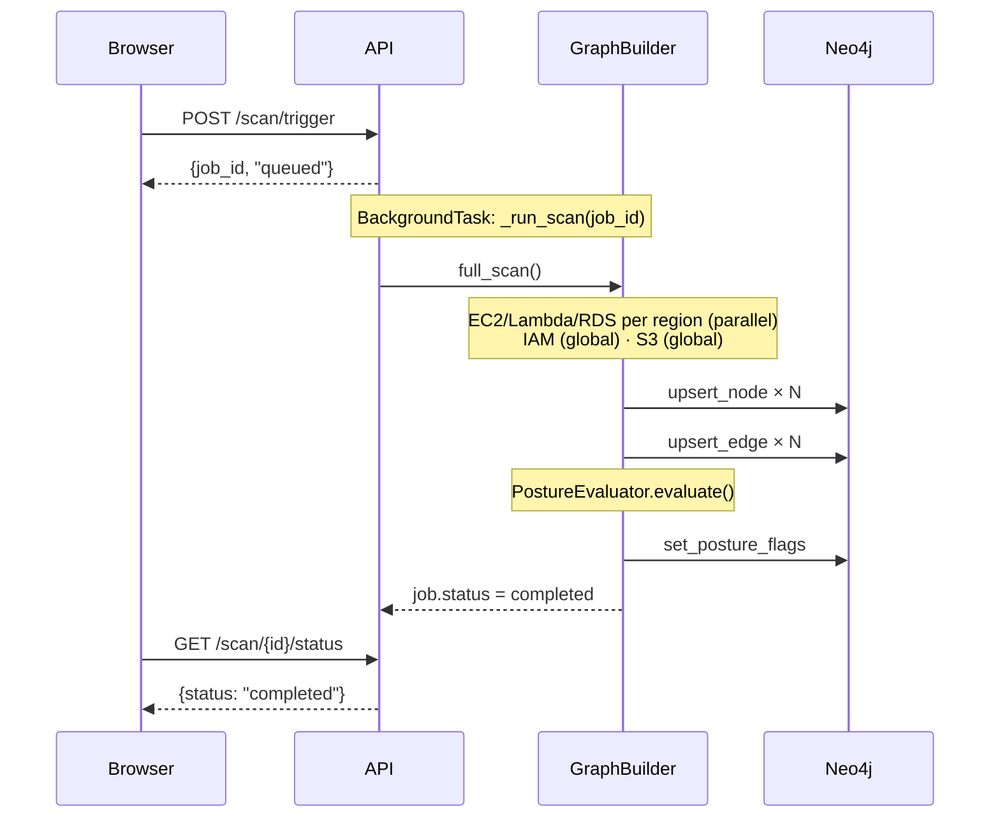
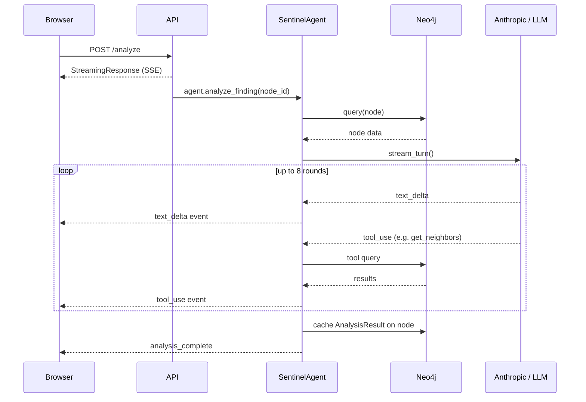
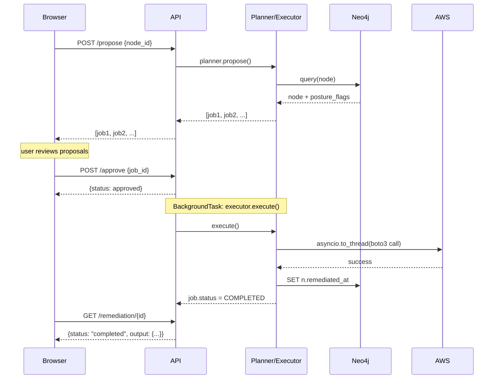

# SENTINEL — Architecture Reference

This document describes the full system architecture: every package, every component, every data flow, and every design decision. Read this before touching the codebase.

---

## Table of Contents

1. [System Overview](#1-system-overview)
2. [Key Concepts](#2-key-concepts)
3. [Package Map and Dependencies](#3-package-map-and-dependencies)
4. [sentinel-core — Data contracts and graph primitives](#4-sentinel-core)
5. [sentinel-perception — AWS discovery](#5-sentinel-perception)
6. [sentinel-agent — LLM reasoning layer](#6-sentinel-agent)
7. [sentinel-remediation — Autonomous remediation](#7-sentinel-remediation)
8. [sentinel-api — HTTP layer](#8-sentinel-api)
9. [Frontend](#9-frontend)
10. [Data Flows](#10-data-flows)
11. [Infrastructure](#11-infrastructure)
12. [Tests](#12-tests)
13. [Configuration Reference](#13-configuration-reference)

---

## 1. System Overview

SENTINEL is an autonomous cloud security architect. It continuously:

1. **Observes** — discovers every resource in an AWS account via boto3
2. **Models** — writes all resources and their relationships into a Neo4j graph
3. **Evaluates** — checks every node against ~30 CIS AWS Benchmark v1.5 rules; stamps violations as posture flags directly on nodes
4. **Reasons** — uses Claude (claude-opus-4-6) with read-only graph tools to produce a structured risk analysis for any flagged node
5. **Remediates** — proposes and (with human approval) executes safe, reversible AWS changes to close the gaps

The graph is the single source of truth. Everything — posture flags, analysis results, remediation outcomes — lives as properties on graph nodes.

### What is security posture?

**Security posture** is the overall security state of a system at a point in time — how well each resource conforms to the security rules it should follow.

In SENTINEL, posture is represented as `posture_flags`: a list of violation strings stamped directly onto each graph node after every scan. A node with no violations has an empty list. A node with problems accumulates one flag per violated rule plus a severity label:

```
n.posture_flags = ["CRITICAL", "S3_PUBLIC_ACCESS", "HIGH", "S3_NO_ENCRYPTION"]
```

Flags are **additive and denormalized** — every violation a node has is visible on the node itself, without joining to any rule table. This makes posture queries as simple as:

```cypher
MATCH (n) WHERE 'CRITICAL' IN n.posture_flags RETURN n
```

The **posture evaluator** produces flags by running CIS rules after each scan. The **findings view** in the UI is just nodes where `posture_flags` is non-empty. The **agent** reads flags to decide what to analyze. The **remediation planner** reads flags to decide what to fix. Posture is the shared language that connects all four packages.

```
AWS Account
    │ boto3 discovery
    ▼
sentinel-perception ──────────────────────────────────────┐
    │ GraphBuilder.full_scan()                            │
    │  ├─ EC2/SG/VPC/Subnet per region                   │
    │  ├─ Lambda per region                               │
    │  ├─ RDS per region                                  │
    │  ├─ IAM (global)                                    │
    │  └─ S3 (global)                                     │
    │                                                     │
    │ upsert nodes + edges (MERGE on node_id)             │
    ▼                                                     │
Neo4j Graph DB ◄──────────────────────────────────────────┘
    │
    ├── sentinel-core (client, queries, CIS evaluator)
    │   ↳ stamps posture_flags on violating nodes after each scan
    │
    ├── sentinel-agent (read-only Cypher tools → Claude → analysis cached on node)
    │
    └── sentinel-remediation (planner reads flags → executor writes outcomes)

sentinel-api (FastAPI) orchestrates all four packages
    ├─ REST endpoints ──────────────────────────────────► Next.js Frontend
    └─ SSE streams                                          ├─ Dashboard
                                                            ├─ Graph Explorer
                                                            ├─ Findings
                                                            └─ Remediations
```

---

## 2. Key Concepts

Brief definitions for terms used throughout this document.

**CIS AWS Foundations Benchmark**: a set of security configuration guidelines published by the Center for Internet Security (CIS). The v1.5 benchmark covers ~100 rules across IAM, storage, networking, and monitoring. SENTINEL implements a subset of ~24 rules as executable checks. Each rule maps to a posture flag. When people say "a CIS violation" they mean a resource that fails one of these checks.

**Cypher**: the query language for Neo4j, analogous to SQL for relational databases. Queries use `MATCH` to traverse nodes and edges, `WHERE` to filter, and `RETURN` to project results. Example: `MATCH (b:S3Bucket {is_public: true}) RETURN b`. SENTINEL uses Cypher for both reads (the agent's graph tools) and writes (upserting nodes, stamping flags).

**Attack path**: a sequence of connected resources that an adversary could exploit to reach a sensitive target. In SENTINEL, attack paths are multi-hop graph traversals — for example: open security group → EC2 instance → IAM role → S3 bucket with sensitive data. A single misconfiguration may not be critical in isolation; its position in an attack path often determines the real risk level.

**Tool-use loop**: the interaction pattern where an LLM is given a set of callable tools and allowed to invoke them multiple times before producing a final response. The agent calls a tool, receives the result, reasons about it, then decides whether to call another tool or stop. SENTINEL gives Claude four read-only graph tools and runs up to 8 rounds before forcing a conclusion. This is distinct from a single-shot prompt: the model actively navigates the graph rather than reasoning from a static context.

**Cross-account access / assume role**: AWS IAM allows one account to delegate access to another by assuming an IAM Role. The caller requests temporary credentials from STS (Security Token Service) by providing a role ARN; the credentials expire after a configured duration. SENTINEL uses this to scan multiple AWS accounts from a single deployment — each connector accepts an `assume_role_arn` and will call `STS.assume_role()` before making API calls.

**Star policy / wildcard IAM**: an IAM policy that grants all actions (`"Action": "*"`) on all resources (`"Resource": "*"`) — effectively giving the principal administrative access to every AWS service. CIS rule 1.16 flags any policy document containing this pattern. It is one of the highest-risk IAM misconfigurations because a compromised identity with a star policy can read, modify, or delete anything in the account.

---

## 3. Package Map and Dependencies

The repo is a **uv workspace** (`pyproject.toml` at root). Five Python packages:

```
sentinel-api             ← imports everything below
  ├─ sentinel-core       ← no internal deps
  ├─ sentinel-perception ← depends on sentinel-core
  ├─ sentinel-agent      ← depends on sentinel-core
  └─ sentinel-remediation ← depends on sentinel-core
```

Each package has its own `pyproject.toml` with `[tool.uv.sources]` workspace references.

| Package | Key external deps |
|---------|-------------------|
| `sentinel-core` | `neo4j` (async driver), `pydantic v2` |
| `sentinel-perception` | `boto3` |
| `sentinel-agent` | `anthropic`, `openai` |
| `sentinel-remediation` | `boto3` |
| `sentinel-api` | `fastapi`, `uvicorn`, `pydantic-settings` |

---

## 3. sentinel-core

**Purpose**: defines what every node and edge looks like, owns the Neo4j connection, runs CIS evaluations, and provides pre-built Cypher queries. Nothing outside this package should ever form raw Cypher by hand (except the agent tools and posture evaluator, which by nature generate queries dynamically).

### 3.1 Enums

All enums extend `StrEnum` — they serialize to plain strings with no `.value` call needed.

| Enum | Values |
|------|--------|
| `CloudProvider` | `aws`, `gcp`, `azure` |
| `ResourceType` | `AWSAccount`, `Region`, `EC2Instance`, `LambdaFunction`, `SecurityGroup`, `VPC`, `Subnet`, `S3Bucket`, `RDSInstance`, `IAMRole`, `IAMUser`, `IAMPolicy` |
| `EdgeType` | `HAS_RESOURCE`, `IN_VPC`, `IN_SUBNET`, `MEMBER_OF_SG`, `CAN_ASSUME`, `HAS_ATTACHED_POLICY`, `EXECUTES_AS`, `PEER_OF` |
| `PostureFlag` | severity labels (`CRITICAL`, `HIGH`, `MEDIUM`, `LOW`) + ~25 specific flags (`SG_OPEN_SSH`, `S3_PUBLIC_ACCESS`, `RDS_PUBLIC`, `EBS_UNENCRYPTED`, `NO_CLOUDTRAIL`, etc.) |
| `Severity` | `CRITICAL`, `HIGH`, `MEDIUM`, `LOW` |

Posture flags are stored as a **string list** on every graph node (`n.posture_flags = ["CRITICAL", "SG_OPEN_SSH"]`). A node with a specific flag also always carries a severity label.

### 3.2 Node models

All node models are Pydantic `BaseModel` subclasses extending `GraphNode`:

```python
class GraphNode(BaseModel):
    node_id: str           # unique identifier (see below)
    cloud_provider: CloudProvider
    account_id: str
    region: str
    resource_type: ResourceType
    tags: dict[str, str]
    discovered_at: datetime
    posture_flags: list[PostureFlag]

    def neo4j_labels(self) -> list[str]:
        return ["GraphNode", self.resource_type]   # e.g. ["GraphNode", "S3Bucket"]

    def to_neo4j_props(self) -> dict:
        # Flattens model to a Neo4j-safe dict (strings, numbers, lists)
        # posture_flags → list[str], datetime → ISO string, etc.
```

`node_id` is a **human-readable stable identifier** constructed by each connector:
- S3: `"s3::{bucket_name}"`
- EC2 instance: `"ec2::{instance_id}"`
- Security group: `"sg::{group_id}"`
- IAM role: `"role::{role_name}"`
- RDS: `"rds::{db_id}"`
- etc.

This scheme ensures the same resource always gets the same `node_id` across scans, making MERGE idempotent.

Resource-specific models add their own typed fields:
- `S3Bucket`: `name`, `is_public`, `versioning`, `encryption`, `logging`, `public_access_block`, `acl_public`, `policy_exists`
- `EC2Instance`: `instance_id`, `instance_type`, `state`, `public_ip`, `ami_id`, `vpc_id`, `subnet_id`, `security_group_ids`
- `SecurityGroup`: `group_id`, `name`, `vpc_id`, `inbound_rules`, `outbound_rules`
- `RDSInstance`: `db_id`, `engine`, `publicly_accessible`, `encrypted`, `multi_az`, `vpc_id`
- `IAMRole`: `role_id`, `name`, `arn`, `trust_policy`, `attached_policy_arns`
- `IAMUser`: `user_id`, `name`, `has_mfa`, `access_key_count`, `password_last_used`
- `LambdaFunction`: `function_name`, `arn`, `runtime`, `role_arn`, `vpc_config`

### 3.3 Edge models

Edge models extend `GraphEdge`:

```python
class GraphEdge(BaseModel):
    from_node_id: str
    to_node_id: str
    edge_type: EdgeType
    account_id: str

    def to_neo4j_props(self) -> dict: ...
```

Concrete edge types:
- `HasResource`: Account→Region, Region→Resource
- `InVPC`: EC2/Lambda/RDS/Subnet → VPC
- `InSubnet`: EC2/RDS → Subnet
- `MemberOfSG`: EC2/Lambda/RDS → SecurityGroup
- `CanAssume`: IAMRole/User → IAMRole (trust relationship)
- `HasAttachedPolicy`: IAMRole/User → IAMPolicy
- `ExecutesAs`: LambdaFunction → IAMRole
- `PeerOf`: VPC ↔ VPC (bidirectional peering)

### 3.4 Neo4jClient

Async wrapper around `neo4j.AsyncGraphDatabase`. One instance exists per API process, initialized at startup and injected everywhere via FastAPI deps.

| Method | Description |
|--------|-------------|
| `connect()` | Open driver, verify connectivity |
| `close()` | Release driver |
| `upsert_node(node)` | `MERGE (n:{labels} {node_id: $id}) SET n += $props` |
| `upsert_edge(edge)` | `MATCH a, MATCH b, MERGE (a)-[r:TYPE]->(b) SET r += $props` |
| `query(cypher, params)` | Execute a read query, return `list[dict]` |
| `execute(cypher, params)` | Execute a write statement (no return) |
| `set_posture_flags(node_id, flags)` | Overwrite `n.posture_flags` |
| `clear_account(account_id)` | `MATCH (n {account_id: $id}) DETACH DELETE n` |
| `ensure_indexes()` | Creates indexes on `node_id`, `account_id`, `resource_type`, `posture_flags` |

Design: MERGE on `node_id` means every write is **idempotent** — re-scanning the same account updates existing nodes, never duplicates them.

### 3.5 GraphQueries

Pre-built Cypher queries for security analysis patterns:

```python
queries = GraphQueries(client)
await queries.find_public_s3_buckets()        # MATCH (b:S3Bucket {is_public: true})
await queries.find_overly_permissive_sgs()    # MATCH sg with 0.0.0.0/0 rules
await queries.find_roles_with_star_actions()  # MATCH (p:IAMPolicy) where document has *
await queries.find_internet_to_rds_paths()    # MATCH path from open SG to public RDS
await queries.find_iam_users_without_mfa()    # MATCH (u:IAMUser {has_mfa: false})
await queries.find_unencrypted_rds()          # MATCH (r:RDSInstance {encrypted: false})
```

These are used directly by the API posture endpoints. The agent's `find_attack_paths` tool is similar in intent but uses its own inline Cypher queries scoped to a specific node, rather than calling these account-wide methods.

### 3.6 CIS rules

Each rule is a Python dataclass (not a DB record):

```python
@dataclass
class CISRule:
    id: str                    # e.g. "CIS-2.1.1"
    title: str
    severity: Severity
    resource_types: list[ResourceType]
    cypher_check: str          # Cypher that returns violating nodes
    posture_flag: PostureFlag  # stamped on each violation
    remediation_hint: str
    tags: list[str]
```

Rules are loaded at process startup and never persisted to the database. The full catalogue is in `ALL_RULES: list[CISRule]` and indexed by `RULES_BY_ID: dict[str, CISRule]` for O(1) lookup.

#### Coverage (24 rules across CIS AWS Foundations Benchmark v1.5)

| Section | Rules | Flags |
|---------|-------|-------|
| 1 — IAM | 1.1, 1.2, 1.3, 1.4, 1.5, 1.10, 1.16 | `IAM_ROOT_USAGE`, `IAM_NO_MFA`, `IAM_STALE_CREDENTIALS`, `IAM_STALE_ACCESS_KEYS`, `IAM_WEAK_PASSWORD_POLICY`, `IAM_STAR_POLICY` |
| 2 — Storage | 2.1.1, 2.1.2, 2.1.5, 2.1.6, 2.2.1, 2.3.1, 2.3.2, 2.3.3 | `S3_NO_POLICY`, `S3_NO_VERSIONING`, `S3_PUBLIC_ACCESS`, `S3_NO_LOGGING`, `EBS_UNENCRYPTED`, `RDS_NO_ENCRYPTION`, `RDS_PUBLIC`, `RDS_NO_MULTI_AZ` |
| 3 — Networking | 3.1, 3.2, 3.3, 3.4 | `SG_OPEN_SSH`, `SG_OPEN_RDP`, `SG_OPEN_ALL_INGRESS`, `VPC_CROSS_ACCOUNT_PEERING` |
| 4 — Monitoring | 4.1, 4.2, 4.3 | `NO_CLOUDTRAIL`, `NO_CLOUDTRAIL_VALIDATION` |
| 5 — Compute | 5.1, 5.2 | `LAMBDA_PUBLIC_URL`, `LAMBDA_NO_VPC` |

#### Two-phase detection

Rules come in two distinct kinds that are easy to confuse:

**Connector-precomputed flags**: some violations require inspecting raw API response data that cannot be expressed as a simple property comparison in Cypher. The connector stamps the flag at discovery time; the Cypher check just reads it back.

Example — `SG_OPEN_SSH`: the EC2 connector inspects each inbound rule dict `{"from_port": 22, "cidr": "0.0.0.0/0"}` and stamps the flag on the `SecurityGroup` node. The CIS-3.1 Cypher check then simply does `WHERE 'SG_OPEN_SSH' IN sg.posture_flags`. This keeps the Cypher layer thin and readable, but it means **connectors and rules are coupled**: if you add a new network-level rule you must also update the connector, not just the rule catalogue.

**Pure-Cypher rules**: property comparisons and graph topology checks that need no connector help.

Examples:
- `MATCH (b:S3Bucket {is_public: true})` — a boolean already on the node
- `MATCH (f:LambdaFunction) WHERE NOT (f)-[:IN_VPC]->(:VPC)` — graph traversal, no pre-stamp needed
- `MATCH (v1:VPC)-[:PEER_OF]->(v2:VPC) WHERE v1.account_id <> v2.account_id` — cross-node edge query

All Cypher checks must return at minimum a `node_id` column — the evaluator does not impose further schema.

#### Severity semantics

Severity is **denormalized onto nodes**: the evaluator stamps both the specific flag (`SG_OPEN_SSH`) and the severity string (`CRITICAL`) into the same `posture_flags` list. This means a single query like `MATCH (n) WHERE 'CRITICAL' IN n.posture_flags` finds all critical violations without joining to the rule catalogue. The trade-off is that the severity is baked in at evaluation time and stale after a benchmark update until the next scan.

#### Gaps and limitations in the current ruleset

- **No KMS rules** — CIS 3.5–3.9 (CMK rotation, KMS key policies) require a `KMSKey` node type not yet modelled
- **No Config/GuardDuty rules** — CIS 4.4–4.15 check for metric filters and CloudWatch alarms; these require log data outside the graph
- **No VPC Flow Logs rule** — VPC flow log status is not yet captured during discovery
- **Stale credential check is approximate** — CIS-1.3 uses `password_last_used` from the IAM connector, which is only available for console users, not programmatic access
- **Access key rotation (CIS-1.4) is incomplete** — the check flags any user with `access_key_count > 0`; it does not actually inspect key creation dates (not yet modelled)

### 3.7 PostureEvaluator

```python
evaluator = PostureEvaluator(client)
findings = await evaluator.evaluate(account_id="123456789012")
```

For each CIS rule:
1. Runs `rule.cypher_check` against Neo4j
2. For each violating node: calls `client.set_posture_flags(node_id, existing_flags + [rule.posture_flag, rule.severity])`
3. Returns `list[Finding]` for the scan result summary

All rules run in parallel via `asyncio.gather()`. Flags are **additive** — a node accumulates all its violations across multiple rule evaluations.

#### Future directions for the rules engine

**Cross-resource attack path rules**: all 24 current rules are single-node property checks. Graph databases shine at multi-hop queries. A natural next step is rules that traverse edges to express compound risk — for example: *"an EC2 instance attached to an open-ingress security group that also executes as an IAM role with a star policy"*. These would return the pair `(instance_node_id, policy_node_id)` and need a new `Finding` shape to capture the full path.

```cypher
MATCH (i:EC2Instance)-[:MEMBER_OF_SG]->(sg:SecurityGroup),
      (i)-[:EXECUTES_AS]->(role:IAMRole)-[:HAS_ATTACHED_POLICY]->(p:IAMPolicy)
WHERE 'SG_OPEN_ALL_INGRESS' IN sg.posture_flags
  AND 'IAM_STAR_POLICY' IN p.posture_flags
RETURN i.node_id AS node_id
```

**Context-sensitive severity**: today severity is static per rule. In practice, a public RDS instance in a VPC with no other exposure is less urgent than one directly reachable via an open security group and a public subnet. Severity could be computed dynamically at evaluation time by walking the graph for additional risk amplifiers.

**Additional benchmarks**: the `CISRule` dataclass is benchmark-agnostic — the `id` field is just a string. SOC 2 CC6/CC7, NIST 800-53 AC/AU/IA, and PCI DSS 3.2 requirements could be expressed as additional rule sets loaded alongside `ALL_RULES`. The key design question is flag namespace isolation: `SOC2_CC6_3_PUBLIC_ACCESS` vs. reusing `S3_PUBLIC_ACCESS`.

**Temporal rules via CloudTrail**: some violations only matter in combination with recent activity. The CloudTrail poller already watches for changes; a rule that says *"this access key has not been rotated in 90 days AND has made S3 Put calls in the last 30 days"* would require joining graph node state with CloudTrail event history, likely via a time-series property on nodes updated by the poller.

**Suppression / exceptions**: production environments need to mark known-acceptable violations (e.g., an intentionally public S3 bucket used for static website hosting). A `suppressed_flags: list[str]` property on nodes — settable via the API — would let the evaluator skip flagging them. The agent and posture summary would need to respect suppressions.

**Remediation link from rule to planner**: `remediation_hint` is currently free text. Structurally linking it to the planner's `_FLAG_MAP` would make rules self-documenting about automated remediation availability, and would let the API surface "remediable: true/false" per finding without the planner being queried separately.

---

## 4. sentinel-perception

**Purpose**: discovers all AWS resources via boto3 and feeds them to the graph.

### 4.1 Shared connector utilities

```python
get_session(region, assume_role_arn) → boto3.Session
    # If assume_role_arn: STS.assume_role(), return session with temp creds
    # Otherwise: default credential chain

paginate(client, method, key) → list
    # Handles boto3 NextToken pagination automatically

run_sync(fn) → coroutine
    # Wraps a sync boto3 call in asyncio.to_thread()
    # Usage: nodes = await run_sync(lambda: client.describe_instances())

safe_get(client, method, default, **kwargs)
    # Returns default on ClientError (e.g., access denied for specific resources)
```

All AWS API calls in connectors are sync boto3 under the hood, wrapped in `asyncio.to_thread()` for async compatibility.

### 4.2 Connector interface

Every connector exposes:

```python
async def discover(
    session: boto3.Session,
    account_id: str,
    region: str,
) -> tuple[list[GraphNode], list[GraphEdge]]:
    ...
```

**IAM connector**: global (no region loop). Discovers roles, users, managed policies. Decodes URL-encoded trust policies (JSON). Builds `CAN_ASSUME` edges (role → role via trust), `HAS_ATTACHED_POLICY` edges (role/user → policy). Detects star actions in policy documents.

**EC2 connector**: per region. Discovers VPCs, Subnets, Security Groups, EC2 Instances. Checks SG inbound rules for `0.0.0.0/0` and `::/0` on ports 22 (SSH), 3389 (RDP), and all ports. Stamps `SG_OPEN_SSH`, `SG_OPEN_RDP`, `SG_OPEN_ALL_INGRESS`. Builds `IN_VPC`, `IN_SUBNET`, `MEMBER_OF_SG` edges.

**S3 connector**: global (ListBuckets once, then per-bucket checks). Checks public access block config, ACL grants, policy existence, versioning, encryption, logging. Stamps `S3_PUBLIC_ACCESS`, `S3_NO_VERSIONING`, etc. S3 buckets have no graph edges (they're standalone global resources).

**Lambda connector**: per region. Extracts VPC config and execution role ARN. Masks environment variable values (stored as `{"KEY": "***"}`). Builds `IN_VPC`, `MEMBER_OF_SG` edges. `EXECUTES_AS` edges are resolved later by `GraphBuilder` after IAM roles are written.

**RDS connector**: per region. Checks `PubliclyAccessible`, `StorageEncrypted`, `MultiAZ`. Builds `IN_VPC`, `MEMBER_OF_SG` edges.

### 4.3 GraphBuilder

The orchestrator. One instance per scan job, injected with a `Neo4jClient`.

```python
result = await builder.full_scan(
    account_id="123456789012",
    regions=["us-east-1", "us-west-2"],
    assume_role_arn=None,        # or ARN for cross-account
    clear_first=False,           # True: DETACH DELETE all nodes first
)
```

Execution order:

```
1. Optional: clear_account(account_id)
2. ensure_indexes()
3. Create/upsert AWSAccount root node
4. Per-region parallel (asyncio.gather):
   └─ _scan_region(region):
      ├─ EC2 discover(session, account_id, region)
      ├─ Lambda discover(session, account_id, region)
      └─ RDS discover(session, account_id, region)
5. IAM discover(session, account_id, "global")       ← global, once
6. S3 discover(session, account_id, "global")        ← global, once
7. Resolve Lambda EXECUTES_AS edges:
   ├─ For each Lambda function: look up its role_arn
   └─ MATCH (r:IAMRole {arn: $arn}) → create ExecutesAs edge
8. Write all nodes (Semaphore(20) bounded):
   └─ upsert_node(n) for n in all_nodes
9. Write all edges (Semaphore(20) bounded):
   └─ upsert_edge(e) for e in all_edges
10. PostureEvaluator(client).evaluate(account_id)
    └─ stamps posture_flags on violating nodes
11. Return ScanResult {nodes_written, edges_written, findings_count, duration_seconds, errors}
```

The `Semaphore(20)` bounds prevent overwhelming Neo4j with concurrent writes. Non-fatal errors (e.g., access denied in one region) are collected in `ScanResult.errors`, not raised.

### 4.4 CloudTrailPoller

Not yet integrated into scans (Phase future). Polls `cloudtrail.lookup_events()` every 60 seconds. Watches for mutation events: `CreateBucket`, `AuthorizeSecurityGroupIngress`, `AttachRolePolicy`, `ModifyDBInstance`, etc. Intended for incremental graph updates — when a mutation event fires, only re-scan the affected resource rather than a full account scan.

---

## 5. sentinel-agent

**Purpose**: Provider-agnostic LLM reasoning layer. The agent reads the graph via 4 read-only tools, reasons about risk and attack paths, and produces a structured `AnalysisResult`. Any Anthropic or OpenAI-compatible provider can be dropped in without changing the tool-use loop.

### 5.0 LLM provider abstraction

The backends sub-package isolates all provider-specific code behind a single `LLMBackend` Protocol. `SentinelAgent` calls only `backend.stream_turn(...)` and processes provider-agnostic events.

**Protocol and stream event dataclasses**:

```python
@dataclass class TextChunk:     text: str
@dataclass class ThinkingChunk: thinking: str   # Anthropic-only
@dataclass class ToolCallChunk: id, name, arguments: dict
@dataclass class TurnComplete:  text, tool_calls, stop_reason

class LLMBackend(Protocol):
    def stream_turn(
        self, messages, system, max_tokens,
        enable_thinking=False, thinking_budget_tokens=8000
    ) -> AsyncIterator[LLMStreamEvent]: ...
```

Messages passed to `stream_turn` are always in **OpenAI format** (`{"role": "user"|"assistant"|"tool", ...}`). Each backend translates internally.

**AnthropicBackend**:
- `_to_anthropic_messages()` converts OpenAI-format history to Anthropic format:
  - `assistant` with `tool_calls` → `assistant` with `tool_use` content blocks
  - Consecutive `tool` messages → single `user` message with `tool_result` blocks
- `_pending_thinking_blocks` — thinking blocks (with `signature`) from the previous turn are stored here and injected into the next Anthropic-format assistant message, preserving multi-turn correctness
- Emits `ThinkingChunk` events for `thinking_delta` stream tokens when extended thinking is active

**OpenAIBackend**:
- Works with any OpenAI Chat Completions API: standard OpenAI, Groq, Ollama, Together AI, vLLM
- Configurable `base_url` parameter; pass `api_key="none"` for local endpoints
- `enable_thinking` is silently ignored (Anthropic-only feature)

**`create_backend(settings) -> LLMBackend`** factory:

```python
def create_backend(settings) -> LLMBackend:
    if settings.provider == "openai":
        return OpenAIBackend(api_key=settings.openai_api_key,
                             model=settings.agent_model,
                             tool_schemas=TOOL_SCHEMAS,
                             base_url=settings.openai_base_url or None)
    return AnthropicBackend(api_key=settings.anthropic_api_key,
                            model=settings.agent_model,
                            tool_schemas=TOOL_SCHEMAS)
```

### 5.1 SSE events and AnalysisResult

**SSE wire format** — every event is a JSON line:

```
data: {"event": "text_delta", "text": "..."}\n\n
data: {"event": "tool_use", "tool_name": "get_neighbors", "tool_input": {...}, "tool_result_summary": "Returned 8 items"}\n\n
data: {"event": "analysis_complete", "result": {...}}\n\n
data: [DONE]\n\n
```

**`AnalysisResult`** (Pydantic model, cached on Neo4j node):

```python
class AnalysisResult(BaseModel):
    node_id: str
    risk_narrative: str           # 2–4 paragraphs
    priority_score: int           # 1–10
    priority_rationale: str       # 1–2 sentences
    remediation_steps: list[RemediationStep]
    attack_paths_summary: str
    model: str                    # "claude-opus-4-6"
    analyzed_at: str              # ISO UTC
```

Stored on Neo4j as: `n.agent_analysis = json.dumps(result.model_dump())`, `n.agent_analyzed_at = "..."`

### 5.2 AgentTools

4 read-only tools available to the LLM during the tool-use loop:

| Tool | What it does |
|------|-------------|
| `get_resource` | Fetch all properties of a single node by `node_id` |
| `get_neighbors` | Undirected BFS up to depth N (max 4) around a node |
| `find_attack_paths` | 3 sequential targeted queries: open-ingress SGs, public exposure, IAM escalation |
| `query_graph` | Arbitrary Cypher read (read-only enforced by safety guard) |

#### `get_neighbors` — undirected BFS

```cypher
MATCH path = (start {node_id: $node_id})-[*1..{depth}]-(neighbor)
RETURN neighbor.node_id, neighbor.resource_type, neighbor.posture_flags,
       [r IN relationships(path) | type(r)] AS relationship_types
LIMIT 50
```

The traversal is **undirected** (the `-` has no arrow). This is intentional: a compromised resource exposes both things it *connects to* (e.g. the VPC it lives in) and things that *connect to it* (e.g. an EC2 instance that mounts it as a volume). Blast-radius assessment requires the full neighbourhood regardless of edge direction.

`depth` is clamped to `[1, 4]`. In practice:
- **depth 1** — direct connections: the SGs this EC2 is a member of, the VPC it lives in, the role it executes as.
- **depth 2** (default) — two hops: other instances in the same SG, IAM policies attached to the role, subnets in the same VPC.
- **depth 3–4** — broader blast radius, but in large environments can return hundreds of nodes; the hard `LIMIT 50` prevents runaway result sets.

Results include the `relationship_types` list for each path so the agent can reason about *how* nodes are connected, not just *that* they are.

#### `find_attack_paths` — three targeted queries

Runs three Cypher queries **sequentially** and combines results into a single list. Each result carries a `path_type` discriminator so the agent can tell which query it came from:

1. **`"open_ingress"`** — finds `SecurityGroup` nodes attached to this resource via `MEMBER_OF_SG` that carry `SG_OPEN_SSH`, `SG_OPEN_RDP`, or `SG_OPEN_ALL_INGRESS`. These represent direct internet exposure of the compute/data tier.

2. **`"public_exposure"`** — checks whether the node itself carries `publicly_accessible = true` or `is_public = true`. This applies to RDS instances, S3 buckets, and similar resources that have an explicit public-accessibility flag separate from their security group.

3. **`"privilege_escalation"`** — follows `CAN_ASSUME` edges up to 3 hops to find `IAMRole` nodes tagged `IAM_STAR_POLICY`. A resource that can assume a wildcard-policy role (directly or transitively) gives an attacker full account-level control. The result includes `hops` so the agent knows whether this is a one-step or multi-step escalation path.

The three queries are distinct by design: you can have internet exposure without public accessibility (a privately-addressed EC2 behind an open SG), and public accessibility without an open SG (an RDS instance with `publicly_accessible = true` but a correctly locked-down SG). Running all three catches cases that any single query would miss.

#### Cypher safety guard (`_safe_cypher()`)

Protects `query_graph` against LLM-generated write operations:

1. **Whitelist** — query must begin with `MATCH`, `OPTIONAL MATCH`, `WITH`, `RETURN`, `CALL`, `UNWIND`, `EXPLAIN`, or `PROFILE`. Anything else is rejected before the blacklist is checked.
2. **Blacklist** — any occurrence of `CREATE`, `MERGE`, `SET`, `DELETE`, `DETACH`, `DROP`, `REMOVE`, or `FOREACH` anywhere in the string is blocked. `CALL` is intentionally absent from the blacklist because it is also a legitimate read keyword (e.g. `CALL db.labels()`); the system-prompt instructs the agent to use only `MATCH … RETURN` queries, making `CALL` an edge case handled by instruction rather than by the guard.
3. **Auto-LIMIT** — if no `LIMIT N` clause is present, `LIMIT 50` is appended.

The two-stage design is defence-in-depth: the whitelist rejects obviously malformed queries early; the blacklist catches attempts to smuggle write keywords inside an otherwise valid `MATCH` clause (e.g. `MATCH (n) SET n.x = 1 RETURN n`).

**`TOOL_SCHEMAS`** — Anthropic-format tool definitions (name, description, input_schema). Used by `AnthropicBackend` directly; `to_openai_tools(TOOL_SCHEMAS)` converts them to OpenAI function format for `OpenAIBackend`.

**`to_openai_tools(schemas)`** — converts Anthropic schema shape `{name, description, input_schema}` to OpenAI shape `{type: "function", function: {name, description, parameters}}`.

### 5.3 Prompts

**System prompt**: instructs Claude that it's a cloud security architect, describes the graph structure, the 4 available tools, and requires output in `<analysis>…</analysis>` XML with specific sub-tags (`risk_narrative`, `priority_score`, `remediation_steps`, etc.).

**`build_finding_message(node_id, posture_flags, account_id)`**: constructs the initial user message for a finding analysis — includes node ID, all posture flags with their CIS rule descriptions, and asks for a structured analysis.

### 5.4 SentinelAgent

```python
agent = SentinelAgent(neo4j_client=client, settings=AgentSettings(...))

# Async generator — yields SSE events
async for event in agent.analyze_finding(node_id, account_id):
    yield event.to_sse().encode()
```

**`AgentSettings`** (plain dataclass, no Pydantic):

```python
@dataclass
class AgentSettings:
    anthropic_api_key: str          # used when provider="anthropic"
    agent_model: str = "claude-opus-4-6"
    agent_max_tokens: int = 4096
    enable_thinking: bool = False
    thinking_budget_tokens: int = 8000
    provider: str = "anthropic"     # "anthropic" | "openai"
    openai_api_key: str = ""        # used when provider="openai"
    openai_base_url: str = ""       # base URL override (Ollama, Groq, …)
```

**`SentinelAgent.__init__`** calls `create_backend(settings)` and stores the result as `self._backend`. No direct SDK import.

**Tool-use loop** (`_run_tool_loop`, max 8 rounds):

```
1. Seed messages list (OpenAI format) with build_finding_message()
2. async for event in self._backend.stream_turn(messages, system, max_tokens, ...):
     TextChunk      → yield TextDeltaEvent
     ThinkingChunk  → yield ThinkingDeltaEvent
     TurnComplete:
       stop_reason == "end_turn" → break
       stop_reason == "tool_use":
         Append OpenAI-format assistant message {role, content:None, tool_calls:[…]}
         For each tool call:
           raw_result = await AgentTools.dispatch(name, arguments)
           yield ToolUseEvent
           Append {role:"tool", tool_call_id:…, content:raw_result}
         → next round
3. Parse accumulated text for <analysis>…</analysis> (regex)
4. Cache on Neo4j: SET n.agent_analysis, n.agent_analyzed_at
5. yield AnalysisCompleteEvent(result)
```

Messages are always kept in **OpenAI format** in the agent loop. Each backend translates to its native format internally before each API call.

`generate_brief(account_id, top_n)` follows the same pattern with a different initial message (top-N findings context instead of a single node).

### 5.5 Extended Thinking (Anthropic only)

Extended thinking gives Claude a private token budget to reason step-by-step before writing its response. It is an Anthropic-specific feature — when `AGENT_PROVIDER=openai`, `enable_thinking` is passed to `OpenAIBackend.stream_turn` but silently ignored.

Implementation lives entirely in `AnthropicBackend`. The agent loop passes `enable_thinking` and `thinking_budget_tokens` through `backend.stream_turn(...)` as keyword arguments.

**Activation**

```python
# Per-agent-instance default (set in AgentSettings from env):
settings = AgentSettings(
    anthropic_api_key="...",
    enable_thinking=True,            # AGENT_ENABLE_THINKING=true
    thinking_budget_tokens=10000,    # AGENT_THINKING_BUDGET_TOKENS=10000
)

# Per-request override (router passes enable_thinking to the method):
async for event in agent.analyze_finding(node_id, account_id, enable_thinking=True):
    ...
```

HTTP API: `POST /agent/findings/{node_id}/analyze?thinking=true`

**AnthropicBackend API call construction**

When `enable_thinking=True`, `AnthropicBackend.stream_turn` adds to the Anthropic API call:

```python
api_kwargs["thinking"] = {
    "type": "enabled",
    "budget_tokens": thinking_budget_tokens,   # e.g. 8000
}
api_kwargs["betas"] = ["interleaved-thinking-2025-05-14"]
# max_tokens raised to max(max_tokens, budget_tokens + 2048) automatically
```

**Thinking blocks and multi-turn correctness**

The Anthropic API returns thinking content as `thinking` blocks (with a cryptographic `signature`). The signature must be preserved across turns. `AnthropicBackend` stores thinking blocks from each turn in `self._pending_thinking_blocks` and injects them into the next assistant message when converting to Anthropic format in `_to_anthropic_messages()`. They are **not** stored in the agent's shared OpenAI-format message list.

**SSE streaming**

`AnthropicBackend.stream_turn` yields `ThinkingChunk` events for each `thinking_delta` token. The agent loop converts these to `ThinkingDeltaEvent` for the client:

```
data: {"event": "thinking_delta", "thinking": "Let me check the VPC..."}\n\n
```

The frontend `AnalysisPanel` renders thinking deltas in a collapsible "Claude's reasoning" panel.

**Caching**

The `AnalysisResult` cached on the Neo4j node (`n.agent_analysis`) is identical whether thinking was used or not — it contains the final structured output, not the reasoning. Thinking tokens are ephemeral and never persisted.

**Token budget guidance**

| Environment | Recommended budget |
|-------------|-------------------|
| Simple findings (single flag) | 4 000–6 000 |
| Multi-flag findings | 6 000–8 000 (default) |
| Complex IAM / attack path analysis | 8 000–12 000 |
| Executive briefs (top-10 findings) | 10 000–16 000 |

`AGENT_MAX_TOKENS` is automatically raised to `budget + 2048` when thinking is enabled, so the agent never hits the token cap mid-response.

---

## 6. sentinel-remediation

**Purpose**: maps CIS posture flags to concrete AWS remediations, enforces human approval, and executes safe boto3 calls with graph write-back.

### 6.1 Models

**`RemediationAction`** — 8 supported actions:

| Action | AWS API | Trigger flag |
|--------|---------|-------------|
| `s3_block_public_access` | `put_public_access_block` | `S3_PUBLIC_ACCESS` |
| `s3_enable_versioning` | `put_bucket_versioning` | `S3_NO_VERSIONING` |
| `s3_enable_sse` | `put_bucket_encryption` | `S3_NO_ENCRYPTION` |
| `s3_enable_logging` | `put_bucket_logging` | `S3_NO_LOGGING` |
| `ec2_enable_ebs_encryption` | `enable_ebs_encryption_by_default` | `EBS_UNENCRYPTED` |
| `cloudtrail_enable` | `create_trail` + `start_logging` | `NO_CLOUDTRAIL` |
| `cloudtrail_log_validation` | `update_trail(EnableLogFileValidation=True)` | `NO_CLOUDTRAIL_VALIDATION` |
| `rds_disable_public_access` | `modify_db_instance(PubliclyAccessible=False)` | `RDS_PUBLIC` |

**`JobStatus`** state machine:

```
PENDING ──► APPROVED ──► EXECUTING ──► COMPLETED
   │                                       │
   └───────────────► REJECTED              └──► FAILED
```

**`RemediationJob`** carries the full lifecycle:

```python
job.job_id           # UUID
job.proposal         # RemediationProposal (action + params + descriptions)
job.status           # current JobStatus
job.proposed_at      # ISO UTC
job.approved_at      # set on approve
job.executed_at      # set when background task starts execution
job.completed_at     # set on COMPLETED or FAILED
job.output           # dict from boto3 on success
job.error            # str on failure
```

### 6.2 RemediationPlanner

```python
planner = RemediationPlanner()
jobs = await planner.propose(node_id="s3::my-bucket", neo4j_client=client)
# Returns list[RemediationJob] with status=PENDING
```

For each flag in `node.posture_flags`, looks up a factory function in `_FLAG_MAP`:

```python
_FLAG_MAP = {
    "S3_PUBLIC_ACCESS":        _s3_block_public_access,
    "S3_NO_VERSIONING":        _s3_enable_versioning,
    "S3_NO_ENCRYPTION":        _s3_enable_sse,
    "S3_NO_LOGGING":           _s3_enable_logging,
    "EBS_UNENCRYPTED":         _ec2_enable_ebs_encryption,
    "NO_CLOUDTRAIL":           _cloudtrail_enable,
    "NO_CLOUDTRAIL_VALIDATION": _cloudtrail_log_validation,
    "RDS_PUBLIC":              _rds_disable_public_access,
}
```

Each factory receives the full Neo4j node dict and returns a `RemediationProposal` with the correct `params` (e.g., `{"bucket_name": "my-bucket"}` for S3 actions). Unknown flags are silently skipped.

### 6.3 RemediationExecutor

```python
executor = RemediationExecutor()
updated_job = await executor.execute(job=job, neo4j_client=client, assume_role_arn=None)
```

Execution flow:
1. Look up remediator function in `_REMEDIATOR_MAP` (maps `RemediationAction` → sync function)
2. Build boto3 session via `_build_session(region, assume_role_arn)` — uses STS if cross-account
3. `await asyncio.to_thread(remediator_fn, proposal.params, session)` — keeps event loop unblocked
4. On success: `job.status = COMPLETED`, `job.output = result dict`
5. On failure: `job.status = FAILED`, `job.error = str(exc)`
6. Write back to Neo4j: `SET n.remediated_at = $ts, n.remediation_job_id = $id`

Neo4j write-back failure is non-fatal (logged as warning) — the AWS change succeeded regardless.

### 6.4 Remediators

Each remediator is a **sync function** called via `asyncio.to_thread()`:

```python
def execute(params: dict, session: boto3.Session) -> dict:
    """Execute the remediation. Return a summary dict."""
```

- S3: `block_public_access`, `enable_versioning`, `enable_sse`, `enable_logging`
- EC2: `enable_ebs_encryption`
- CloudTrail: `enable_trail` (creates S3 bucket + bucket policy + CloudTrail trail + start logging), `enable_log_validation`
- RDS: `disable_public_access`

`cloudtrail.enable_trail` is the most complex: it first checks if the trail already exists, creates the target S3 bucket with the appropriate bucket policy if not, then creates the trail and starts logging. If the trail exists, it just starts logging.

---

## 7. sentinel-api

**Purpose**: HTTP layer. Thin bridge between external clients and the four packages. Owns dependency injection, request validation, background tasks, and SSE streaming.

### 7.1 Settings

`pydantic-settings` class loaded from environment / `.env` file. All settings are available via `get_settings()` which is `@lru_cache` — one instance per process.

Key settings grouped by concern:

```
# Neo4j
neo4j_uri, neo4j_user, neo4j_password

# AWS
aws_default_region, aws_regions (CSV → regions_list property), aws_assume_role_arn

# API
api_port, enable_raw_cypher

# Security
api_key              # empty = disabled; set to enforce X-API-Key header
rate_limit_enabled   # false (dev default) / true (production)

# AI Agent
anthropic_api_key, agent_model, agent_max_tokens
agent_enable_thinking        # default global thinking mode
agent_thinking_budget_tokens # token budget when thinking is active

# Persistence
sentinel_db_path     # path to SQLite file (default: ./sentinel.db)

# CloudTrail polling
enable_cloudtrail_polling, aws_account_id, cloudtrail_poll_interval
```

### 7.2 Dependency injection

Two module-level singletons — one for Neo4j, one for the SQLite store — initialised at startup and injectable via FastAPI `Depends`:

```python
# Neo4j
_neo4j_client: Neo4jClient | None = None
get_neo4j_client() / set_neo4j_client(client)
Neo4jDep = Annotated[Neo4jClient, Depends(get_neo4j_client)]

# SQLite store
_store: SentinelStore | None = None
get_store() / set_store(store)
StoreDep = Annotated[SentinelStore, Depends(get_store)]

# Derived deps
QueriesDep   = Annotated[GraphQueries,     Depends(get_graph_queries)]
EvaluatorDep = Annotated[PostureEvaluator, Depends(get_posture_evaluator)]
AgentDep     = Annotated[SentinelAgent,    Depends(get_sentinel_agent)]
SettingsDep  = Annotated[Settings,         Depends(get_settings)]
```

Both `get_store()` and `get_neo4j_client()` raise `RuntimeError` when called before startup — the lifespan checks for this to detect pre-injected test fixtures (E2E tests inject a `:memory:` store to avoid creating `./sentinel.db`).

### 7.3 App lifecycle

```python
@asynccontextmanager
async def lifespan(app):
    # Fast path when both are pre-injected (E2E test mode)
    if neo4j_pre_injected and store_pre_injected:
        yield; return

    # Normal startup
    client = Neo4jClient(uri, user, password)
    await client.connect()
    await client.ensure_indexes()
    set_neo4j_client(client)

    store = SentinelStore(db_path=settings.sentinel_db_path)
    await store.initialize()   # CREATE TABLE IF NOT EXISTS + WAL mode
    set_store(store)

    yield  # app runs

    # Teardown
    await client.close()
    await store.close()
    set_store(None)
```

**Middleware stack** (registered in `create_app()`):

```python
app.state.limiter = limiter                             # slowapi rate limiter
app.add_exception_handler(RateLimitExceeded, handler)  # 429 responses
app.add_middleware(SecurityHeadersMiddleware)           # defensive HTTP headers
app.add_middleware(ApiKeyMiddleware)                    # X-API-Key enforcement
app.add_middleware(CORSMiddleware, ...)                 # allow localhost:3000
```

`SecurityHeadersMiddleware` adds: `X-Content-Type-Options: nosniff`, `X-Frame-Options: DENY`, `X-XSS-Protection: 1; mode=block`, `Referrer-Policy: strict-origin-when-cross-origin`, `Permissions-Policy`.

`ApiKeyMiddleware` is a transparent passthrough when `API_KEY` is empty (default). When set, it enforces `X-API-Key` on all paths except `/health`, `/docs`, `/redoc`, `/openapi.json`.

All routers mounted at `/api/v1`:
- `graph.router` → `/api/v1/graph/...`
- `posture.router` → `/api/v1/posture/...`
- `scan.router` → `/api/v1/scan/...`
- `agent.router` → `/api/v1/agent/...`
- `accounts.router` → `/api/v1/accounts/...`
- `remediation.router` → `/api/v1/remediation/...`

### 7.4 Router quick reference

**Scan**

```
POST /scan/trigger                                             rate: 10/min
    body: { account_id?, regions?, assume_role_arn?, clear_first? }
    → { job_id, status: "queued", account_id }

GET  /scan/{job_id}/status
    → ScanJobResponse { job_id, status, result?, error? }

GET  /scan/
    → list[ScanJobResponse]  (newest first)
```

Job state persisted in SQLite (`scan_jobs` table) via `StoreDep`. `BackgroundTasks.add_task(_run_scan, ..., store=store)` calls `GraphBuilder.full_scan()`, then writes `status=completed/failed` back via `store.update_scan_job()`.

**Graph**

```
GET  /graph/nodes?type=S3Bucket&region=us-east-1&limit=50
GET  /graph/nodes/{node_id}             → node + edges list
GET  /graph/nodes/{node_id}/neighbors?depth=2  → {nodes, edges, root_node_id}
POST /graph/query  (requires ENABLE_RAW_CYPHER=true)
    body: { cypher, params? }
```

**Posture**

```
GET  /posture/findings?severity=CRITICAL&resource_type=S3Bucket
GET  /posture/summary?account_id=...
GET  /posture/cis-rules
```

**Agent**

```
POST /agent/findings/{node_id}/analyze?thinking=false   rate: 20/min
    → StreamingResponse (text/event-stream)
    Events: text_delta | thinking_delta | tool_use | analysis_complete | error
    ?thinking=true enables extended thinking (see section 5.5)

GET  /agent/findings/{node_id}/analysis
    → AnalysisResult (cached on Neo4j node) | 404

POST /agent/brief?account_id=...&top_n=5&thinking=false
    → StreamingResponse (text/event-stream)
    Not cached — each call triggers a fresh agent run.
```

SSE headers: `Content-Type: text/event-stream`, `Cache-Control: no-cache`, `X-Accel-Buffering: no` (disables nginx proxy buffering).

**Remediation**

```
POST /remediation/propose            rate: 30/min
    body: { node_id }  → list[RemediationJob] (all PENDING)

GET  /remediation/       → list[RemediationJob] (newest first)
GET  /remediation/{id}   → RemediationJob
POST /remediation/{id}/approve  → RemediationJob (queues background execution)
POST /remediation/{id}/reject   → RemediationJob
```

Job state persisted in SQLite (`remediation_jobs` table) via `StoreDep`. Approve triggers `BackgroundTasks.add_task(_execute_job, ..., store=store)` which calls `RemediationExecutor.execute()` then writes the updated job back.

---

## 8. Frontend

**Stack**: Next.js 14 (App Router), TypeScript 5, Tailwind CSS, Cytoscape.js (graph), no state management library.

### 8.1 Pages

| Page | Route | What it does |
|------|-------|-------------|
| Dashboard | `/` | Posture summary cards (CRITICAL/HIGH counts), scan trigger button with animated progress indicator, "Scan history" link |
| Graph Explorer | `/graph` | Full Cytoscape.js visualization of all nodes/edges, filter by type/severity, click node to see detail |
| Findings | `/findings` | Table of all flagged nodes, filter by severity and resource type, click row to drill down |
| Finding Detail | `/findings/[id]` | All node properties, posture flags, "Propose Remediation" button, agent `AnalysisPanel` |
| Scans | `/scans` | Full scan history table (status, started, account, regions, nodes, edges, findings, duration); auto-polls when jobs active; trigger button |
| Remediations | `/remediations` | All remediation jobs with status tabs, approve/reject with confirmation modal, polls every 3s while executing |

### 8.2 Key Components

**CytoscapeCanvas**: wraps Cytoscape.js. Receives `{ nodes, edges }` props. Node colors by `resource_type`, border glow by highest severity flag. Uses `cola` force-directed layout. Emits `onNodeClick(nodeId)`. Dynamically imported (no SSR) because Cytoscape uses `window`.

**AnalysisPanel**: SSE streaming display. Shows a "Analyze with AI" button; on click calls `agentApi.streamAnalysis()`. As events arrive:
- `text_delta` → appends to live text display
- `tool_use` → adds pill to "Graph queries" list
- `analysis_complete` → replaces live display with final structured output
- `error` → shows inline error with retry

Also accepts `initialAnalysis` prop — if passed (from cached `GET /analysis`), renders the cached result immediately without streaming.

**RemediationProposalCard**: shows action label, resource info, description, risk reduction panel, output/error on completion. Approve/Reject buttons call parent callbacks.

**ApprovalModal**: confirmation dialog overlay. Two modes: `"approve"` (warns about immediate AWS change) and `"reject"`. Calls `remediationApi.approve()` or `.reject()` on confirm, updates parent job state.

### 8.3 API client

All API calls centralized here. Uses a shared `apiFetch<T>` helper that:
- Prepends `NEXT_PUBLIC_API_URL` (default: `http://localhost:8000/api/v1`)
- Sets `Content-Type: application/json`
- Throws on non-2xx with the response body as the error message

```typescript
// Typed API namespaces:
graphApi      // listNodes, getNode, getNeighbors, rawQuery
postureApi    // getFindings, getSummary, getRules
scanApi       // trigger, getStatus, listScans
agentApi      // streamAnalysis (SSE), getAnalysis
remediationApi // propose, list, get, approve, reject
accountsApi   // register, list, get
```

`agentApi.streamAnalysis()` uses the browser's `fetch` + `ReadableStream` API directly (not `EventSource`) to handle `POST` with SSE — `EventSource` only supports `GET`.

---

## 9. Data Flows

### 9.1 Full Scan Flow



### 9.2 Agent Analysis Flow



### 9.3 Remediation Flow



---

## 10. Infrastructure

### 10.1 Docker Compose

Two services:

**`neo4j`** (always started):
- Image: `neo4j:5-community`
- Browser: `http://localhost:7474`
- Bolt: `bolt://localhost:7687`
- Auth: `neo4j / sentinel_dev`
- APOC plugin enabled
- Memory: 512M pagecache, 512M–1G heap
- Health check: `cypher-shell "MATCH (n) RETURN count(n)"` (30s timeout, 10s interval)

**`api`** (optional, profile `api`):
- Built from the API Dockerfile
- Port `8000`
- Depends on neo4j health check passing
- Environment from `.env`

For local development, run the API directly with uvicorn (`make dev`) rather than through Docker.

### 10.2 Make targets

| Target | What it does |
|--------|-------------|
| `make neo4j` | `docker compose up neo4j -d` |
| `make dev` | Start Neo4j + `uvicorn sentinel_api.main:app --reload --port 8000` |
| `make frontend` | `cd frontend && npm run dev` |
| `make scan` | `curl -s -X POST http://localhost:8000/api/v1/scan/trigger -d '{}' | jq` |
| `make test` | `pytest tests/unit tests/integration -v` |
| `make test-e2e` | `pytest tests/e2e -v -m e2e --timeout=120` (requires Docker) |
| `make lint` | `ruff check . && mypy packages/` |
| `make fmt` | `ruff format .` |
| `make install` | `uv sync` |
| `make install-all` | `uv sync && cd frontend && npm install` |
| `make clean` | Stop containers, remove volumes, clear `__pycache__` |

---

## 11. Tests

### 11.1 Structure

**Unit** — fast, no external deps. AWS mocked via `moto`; Neo4j mocked via `AsyncMock`. Covers: Pydantic model validation and Neo4j serialization; CIS rule schema and Cypher syntax; GraphBuilder with mock AWS and Neo4j; agent tool dispatch and Cypher safety guard; agent streaming loop, XML parsing, and result caching; extended thinking kwargs and ThinkingChunk events; LLM backend protocol and AnthropicBackend message translation; RemediationPlanner flag-to-action mapping; each remediator with mocked boto3; all five AWS connectors (EC2/SG/VPC, IAM, S3, RDS, Lambda) with moto.

**Integration** — FastAPI TestClient; endpoint response shapes; full scan + evaluation with moto and in-memory Neo4j mock.

**E2E** (`pytest -m e2e`, requires Docker) — real Neo4j 5 Community container via testcontainers. Covers: scan writes nodes and edges to real graph; CIS evaluation against real graph; API endpoints against live Neo4j; Cypher attack path queries; agent HTTP API with MockBackend and real Neo4j; remediation planner + executor against real Neo4j.

### 11.2 Patterns

**Unit tests**: all AWS mocked via `moto` decorators; Neo4j mocked via `AsyncMock`. Fast, no external deps.

**Integration tests**: use `httpx.AsyncClient(app=app, base_url="http://test")` as FastAPI test client. In-memory job stores reset between tests. Mock Neo4j.

**E2E tests**: marked `@pytest.mark.e2e`. Require Docker. `neo4j_container` fixture (session-scoped) starts a real Neo4j 5 Community container via `testcontainers`. `clean_db` fixture (function-scoped) wipes all nodes between tests. Run with `pytest -m e2e`.

Async tests use `pytest-asyncio` with `asyncio_mode = "auto"` in `pyproject.toml` — no `@pytest.mark.asyncio` decorator needed.

**Agent tests**: inject a `MockBackend` directly onto `agent._backend` — no real LLM API calls are made. Agent unit tests use a `CapturingMockBackend` that records `stream_turn` kwargs and yields configurable event sequences. Backend message translation is tested against `AnthropicBackend._to_anthropic_messages()` in isolation with no network I/O.

---

## 12. Configuration Reference

Copy `.env.example` to `.env` and fill in your values. The API reads from `.env` automatically via `pydantic-settings`.

### Neo4j

| Variable | Default | Description |
|----------|---------|-------------|
| `NEO4J_URI` | `bolt://localhost:7687` | Neo4j Bolt URI |
| `NEO4J_USER` | `neo4j` | Neo4j username |
| `NEO4J_PASSWORD` | `sentinel_dev` | Password (required in production) |

### AWS

| Variable | Default | Description |
|----------|---------|-------------|
| `AWS_DEFAULT_REGION` | `us-east-1` | Default boto3 region |
| `AWS_REGIONS` | `us-east-1` | Comma-separated regions to scan |
| `AWS_ASSUME_ROLE_ARN` | — | IAM Role to assume for cross-account |
| `AWS_ACCOUNT_ID` | — | Required when `ENABLE_CLOUDTRAIL_POLLING=true` |

### API

| Variable | Default | Description |
|----------|---------|-------------|
| `API_PORT` | `8000` | FastAPI listen port |
| `ENABLE_RAW_CYPHER` | `false` | Enable `POST /graph/query` (dev only) |
| `SENTINEL_DB_PATH` | `./sentinel.db` | SQLite file for job persistence |

### Security

| Variable | Default | Description |
|----------|---------|-------------|
| `API_KEY` | — | When set, enforce `X-API-Key` header on all requests |
| `RATE_LIMIT_ENABLED` | `false` | Enable per-IP rate limits in production |

### AI Agent (Phase 2)

| Variable | Default | Description |
|----------|---------|-------------|
| `AGENT_PROVIDER` | `anthropic` | LLM provider: `anthropic` or `openai` (any OpenAI-compatible) |
| `ANTHROPIC_API_KEY` | — | Required when `AGENT_PROVIDER=anthropic` |
| `OPENAI_API_KEY` | — | Required when `AGENT_PROVIDER=openai` |
| `AGENT_BASE_URL` | — | Base URL for OpenAI-compatible providers (e.g. `http://localhost:11434/v1`) |
| `AGENT_MODEL` | `claude-opus-4-6` | Model ID to request from the configured provider |
| `AGENT_MAX_TOKENS` | `4096` | Max tokens per response turn |
| `AGENT_ENABLE_THINKING` | `false` | Enable extended thinking globally (Anthropic only) |
| `AGENT_THINKING_BUDGET_TOKENS` | `8000` | Token budget for internal reasoning (Anthropic only) |

### CloudTrail Polling (opt-in)

| Variable | Default | Description |
|----------|---------|-------------|
| `ENABLE_CLOUDTRAIL_POLLING` | `false` | Start background CloudTrail poller |
| `CLOUDTRAIL_POLL_INTERVAL` | `60` | Poll interval in seconds |
