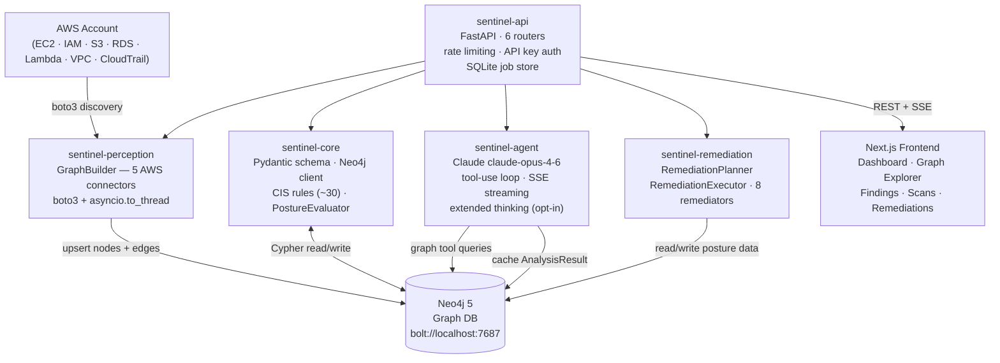

# SENTINEL

**Autonomous cloud security architect** — continuously discovers, evaluates, and remediates security vulnerabilities in AWS infrastructure.

SENTINEL builds a live graph of your cloud environment, evaluates every resource against the CIS AWS Foundations Benchmark v1.5, streams AI-powered risk analysis, and executes safe reversible remediations with human approval.

---

## What it does

1. **Discovers** every resource in your AWS account (EC2, IAM, S3, RDS, Lambda, VPCs, Security Groups) via boto3 and writes them to a Neo4j graph.
2. **Evaluates** all resources against ~30 CIS rules. Violations are stamped directly on graph nodes as `posture_flags`.
3. **Analyzes** any finding using Claude (`claude-opus-4-6`) with 4 read-only graph query tools. Streams reasoning token-by-token via SSE. Results are cached on the graph node. Optionally enables **extended thinking** for deeper multi-step reasoning.
4. **Remediates** flagged resources with human approval — proposes safe, reversible AWS changes; executes on approval; writes outcomes back to the graph.

---

## System Architecture



---

## Package Overview

| Package | Path | Responsibility |
|---------|------|----------------|
| `sentinel-core` | `packages/core/` | Graph schema (Pydantic nodes/edges), async Neo4j client, CIS rules (~30), posture evaluator, pre-built Cypher queries |
| `sentinel-perception` | `packages/perception/` | 5 AWS connectors (boto3), `GraphBuilder` orchestrator, CloudTrail change poller |
| `sentinel-agent` | `packages/agent/` | `SentinelAgent` — Claude tool-use loop, 4 read-only graph tools, SSE events, `AnalysisResult` caching, extended thinking |
| `sentinel-remediation` | `packages/remediation/` | `RemediationPlanner` (flags → jobs), `RemediationExecutor` (boto3 dispatch + Neo4j write-back), 8 safe remediators |
| `sentinel-api` | `packages/api/` | FastAPI app, 6 routers, dependency injection, background tasks, SSE streaming, SQLite persistence |

Dependency order: `sentinel-api` → `{core, perception, agent, remediation}` → (nothing internal)

See [ARCHITECTURE.md](ARCHITECTURE.md) for a complete file-by-file breakdown and all data flows.

---

## Quickstart

### Prerequisites

- **Docker + Docker Compose** (for Neo4j)
- **Python 3.12+** with [uv](https://docs.astral.sh/uv/)
- **Node.js 20+** with npm
- **AWS credentials** configured (default credential chain, `~/.aws/credentials`, or env vars)

### 1. Clone and configure

```bash
git clone https://github.com/baselyne-systems/sentinel.git
cd sentinel
cp .env.example .env
```

Edit `.env` at minimum:

```bash
AWS_REGIONS=us-east-1          # comma-separated regions to scan
ANTHROPIC_API_KEY=sk-ant-...   # required for AI analysis (Phase 2)
# AWS_ASSUME_ROLE_ARN=arn:...  # optional: for cross-account scanning
```

### 2. Start Neo4j

```bash
make neo4j
# Neo4j browser → http://localhost:7474  (user: neo4j / sentinel_dev)
# Bolt URI       → bolt://localhost:7687
```

### 3. Start the API

```bash
make install   # uv sync — installs all 5 packages
make dev       # uvicorn --reload on port 8000
# API            → http://localhost:8000
# OpenAPI docs   → http://localhost:8000/docs
```

### 4. Start the frontend

```bash
make install-frontend   # npm install
make frontend           # next dev on port 3000
# UI → http://localhost:3000
```

### 5. Scan your AWS account

```bash
make scan
# or:
curl -s -X POST http://localhost:8000/api/v1/scan/trigger \
  -H "Content-Type: application/json" \
  -d '{"regions": ["us-east-1"]}' | jq
```

Poll for completion:

```bash
curl -s http://localhost:8000/api/v1/scan/{job_id}/status | jq .status
```

### 6. View findings in the UI

Open `http://localhost:3000` and navigate to **Findings**. Click any finding to see its properties, run an AI analysis, or propose a remediation.

---

## Key Workflows

### Scan → Graph → Posture

```
POST /api/v1/scan/trigger
    → GraphBuilder discovers all AWS resources (parallel per region)
    → Upserts nodes + edges into Neo4j (MERGE on node_id)
    → PostureEvaluator stamps posture_flags on violating nodes
    → GET /api/v1/posture/findings returns all violations
    → GET /api/v1/scan/ returns full scan history (persisted across restarts)
```

### Finding → AI Analysis (streaming)

```
POST /api/v1/agent/findings/{node_id}/analyze[?thinking=true]
    → SentinelAgent runs Claude tool-use loop (max 8 rounds)
    → Streams text tokens + tool events via SSE
    → With ?thinking=true: also streams thinking_delta events (extended thinking)
    → Caches AnalysisResult on Neo4j node
    → GET /api/v1/agent/findings/{node_id}/analysis returns cached result
```

### Finding → Remediation

```
POST /api/v1/remediation/propose {"node_id": "..."}
    → RemediationPlanner maps posture_flags → RemediationJobs (PENDING)
POST /api/v1/remediation/{job_id}/approve
    → RemediationExecutor runs boto3 call in background thread
    → On success: stamps remediated_at + remediation_job_id on node
GET  /api/v1/remediation/{job_id}
    → {status: "completed", output: {...}}
```

---

## API Reference

All endpoints are at `http://localhost:8000/api/v1`. Full OpenAPI spec at `/docs`.

### Scan

| Method | Path | Description |
|--------|------|-------------|
| `POST` | `/scan/trigger` | Start a background scan. Body: `{account_id?, regions?, assume_role_arn?, clear_first?}` |
| `GET` | `/scan/{job_id}/status` | Poll scan status: `queued → running → completed / failed` |
| `GET` | `/scan/` | List all scan jobs, newest first (persisted in SQLite) |

### Graph

| Method | Path | Description |
|--------|------|-------------|
| `GET` | `/graph/nodes` | List nodes. Query: `?type=S3Bucket&region=us-east-1&limit=50` |
| `GET` | `/graph/nodes/{node_id}` | Node detail with edge list |
| `GET` | `/graph/nodes/{node_id}/neighbors` | BFS subgraph. Query: `?depth=2` |
| `POST` | `/graph/query` | Raw Cypher (requires `ENABLE_RAW_CYPHER=true`) |

### Posture

| Method | Path | Description |
|--------|------|-------------|
| `GET` | `/posture/findings` | All flagged nodes. Query: `?severity=CRITICAL&resource_type=S3Bucket` |
| `GET` | `/posture/summary` | Counts by severity, alignment percentage |
| `GET` | `/posture/cis-rules` | All ~30 CIS rules with severity and remediation hints |

### Agent (AI Analysis)

| Method | Path | Description |
|--------|------|-------------|
| `POST` | `/agent/findings/{node_id}/analyze` | Stream AI analysis via SSE. Add `?thinking=true` for extended thinking. |
| `GET` | `/agent/findings/{node_id}/analysis` | Cached `AnalysisResult` (404 if not yet run) |
| `POST` | `/agent/brief` | Stream executive brief. Query: `?account_id=...&top_n=5&thinking=true` |

### Remediation

| Method | Path | Description |
|--------|------|-------------|
| `POST` | `/remediation/propose` | Body: `{node_id}` → `list[RemediationJob]` (PENDING) |
| `GET` | `/remediation/` | All jobs, newest first (persisted in SQLite) |
| `GET` | `/remediation/{job_id}` | Single job detail |
| `POST` | `/remediation/{job_id}/approve` | Approve → triggers background execution |
| `POST` | `/remediation/{job_id}/reject` | Reject → no AWS changes |

---

## Extended Thinking

Extended thinking gives Claude a private scratchpad to reason step-by-step before producing its final answer. For complex security findings — multi-hop attack paths, intricate IAM privilege escalation chains, or findings that require cross-referencing many resources — extended thinking produces materially more thorough analysis than the default mode.

### How it works

When extended thinking is active:

1. Claude receives an internal token budget (`AGENT_THINKING_BUDGET_TOKENS`, default 8 000) to reason freely before writing its response. This reasoning is done using the `interleaved-thinking-2025-05-14` Anthropic beta.
2. Thinking tokens stream to the client as `thinking_delta` SSE events, distinct from the normal `text_delta` events.
3. Thinking blocks carry a cryptographic **signature** that is preserved in the multi-turn message history — the Anthropic API requires this for correctness across tool-use rounds.
4. The final `AnalysisResult` cached on the graph node is the same structure regardless of whether thinking was used; the thinking itself is not stored.

### Enabling extended thinking

**Per-request (recommended for interactive use):**

```bash
# Analyze a specific finding with extended thinking
curl -s -X POST \
  "http://localhost:8000/api/v1/agent/findings/s3::my-bucket/analyze?thinking=true"

# Executive brief with extended thinking
curl -s -X POST \
  "http://localhost:8000/api/v1/agent/brief?thinking=true&top_n=5"
```

**Always-on (enable by default for all requests):**

```bash
# .env
AGENT_ENABLE_THINKING=true
AGENT_THINKING_BUDGET_TOKENS=10000   # increase for very complex environments
```

When `AGENT_ENABLE_THINKING=true`, extended thinking is active for every analysis. Individual requests can still pass `?thinking=false` to skip it for a specific call.

### SSE events with extended thinking

With `?thinking=true` the event stream includes an additional event type:

```
data: {"event": "thinking_delta", "thinking": "Let me first check..."}\n\n
data: {"event": "thinking_delta", "thinking": "The S3 bucket has..."}\n\n
data: {"event": "text_delta", "text": "This resource has..."}\n\n
data: {"event": "tool_use", "tool_name": "get_neighbors", ...}\n\n
...
data: {"event": "analysis_complete", "result": {...}}\n\n
data: [DONE]\n\n
```

`thinking_delta` events are emitted as Claude reasons internally. The `AnalysisPanel` component in the frontend renders them in a collapsible "Claude's reasoning" panel, separate from the main analysis stream.

### Token budget and cost

Extended thinking consumes additional tokens beyond the main response:

| Setting | Default | Notes |
|---------|---------|-------|
| `AGENT_THINKING_BUDGET_TOKENS` | `8000` | Tokens reserved for Claude's internal reasoning |
| `AGENT_MAX_TOKENS` | `4096` | Max tokens in the visible response. Auto-raised to `budget + 2048` when thinking is active. |

Typical thinking usage is 3 000–6 000 tokens per analysis. Raise the budget for environments with many interconnected resources (large VPCs, complex IAM chains).

### When to use extended thinking

| Use extended thinking | Use standard mode |
|-----------------------|-------------------|
| Complex IAM privilege escalation analysis | Simple single-flag violations (open SSH port) |
| Multi-hop attack path reasoning | Quick triage / bulk findings review |
| Executive briefs covering 10+ findings | Dev/test environments |
| Unfamiliar environments needing deep exploration | Latency-sensitive applications |

---

## Supported Remediations

8 safe, reversible actions. Human approval always required.

| Action | Trigger Flag | AWS API Call |
|--------|-------------|-------------|
| Block S3 Public Access | `S3_PUBLIC_ACCESS` | `put_public_access_block` |
| Enable S3 Versioning | `S3_NO_VERSIONING` | `put_bucket_versioning` |
| Enable S3 Encryption (AES-256) | `S3_NO_ENCRYPTION` | `put_bucket_encryption` |
| Enable S3 Access Logging | `S3_NO_LOGGING` | `put_bucket_logging` |
| Enable EBS Encryption by Default | `EBS_UNENCRYPTED` | `enable_ebs_encryption_by_default` |
| Enable CloudTrail | `NO_CLOUDTRAIL` | `create_trail` + `start_logging` |
| Enable CloudTrail Log Validation | `NO_CLOUDTRAIL_VALIDATION` | `update_trail(EnableLogFileValidation=True)` |
| Disable RDS Public Accessibility | `RDS_PUBLIC` | `modify_db_instance(PubliclyAccessible=False)` |

---

## CIS Rules Covered (~30 total)

| Domain | Rules |
|--------|-------|
| IAM | No MFA on users, star (*) policies, root account usage, stale credentials, weak password policy |
| S3 | Public access, no versioning, no encryption, no logging, no bucket policy |
| Security Groups | Open SSH (port 22), open RDP (port 3389), all-ingress (0.0.0.0/0) |
| RDS | Publicly accessible, unencrypted, no Multi-AZ |
| CloudTrail | Not enabled, no log file validation |
| EC2 | EBS volumes not encrypted |
| Lambda | Public function URL, no VPC attachment |
| VPC | Cross-account peering |

---

## Development Commands

| Command | Description |
|---------|-------------|
| `make dev` | Start Neo4j + API in watch mode |
| `make neo4j` | Start Neo4j container only |
| `make frontend` | Start Next.js dev server |
| `make scan` | Trigger a full AWS scan via curl |
| `make test` | Run unit + integration tests (no Docker needed) |
| `make test-e2e` | Run E2E tests (requires Docker) |
| `make lint` | `ruff check` + `mypy` |
| `make fmt` | Auto-format with `ruff format` |
| `make install` | `uv sync` — install all Python packages |
| `make install-all` | `uv sync` + `npm install` |
| `make up-prod` | Start full production stack (Neo4j + API + frontend + Nginx) |
| `make down-prod` | Stop production stack |
| `make clean` | Stop containers, remove volumes, clear caches |

---

## Testing

```bash
# Unit tests — no AWS creds or Docker needed
uv run pytest tests/unit/ -v

# Integration tests — no Docker needed
uv run pytest tests/integration/ -v

# E2E tests — requires Docker (Neo4j testcontainer)
uv run pytest tests/e2e/ -v -m e2e --timeout=120

# All tests
make test-all
```

Unit and integration tests use **moto** for AWS mocking (S3, EC2, IAM, RDS, CloudTrail) and `AsyncMock` for Neo4j. E2E tests use **testcontainers** to spin up a real Neo4j 5 Community instance.

---

## Environment Variables

### Core

| Variable | Default | Description |
|----------|---------|-------------|
| `NEO4J_URI` | `bolt://localhost:7687` | Neo4j Bolt connection URI |
| `NEO4J_USER` | `neo4j` | Neo4j username |
| `NEO4J_PASSWORD` | `sentinel_dev` | Neo4j password (required in production) |
| `AWS_DEFAULT_REGION` | `us-east-1` | Default AWS region |
| `AWS_REGIONS` | `us-east-1` | Comma-separated regions to scan |
| `AWS_ASSUME_ROLE_ARN` | — | IAM role ARN for cross-account scanning |
| `API_PORT` | `8000` | FastAPI listen port |
| `ENABLE_RAW_CYPHER` | `false` | Enable `POST /graph/query` dev endpoint |
| `SENTINEL_DB_PATH` | `./sentinel.db` | SQLite file for scan/remediation job history |

### AI Analysis (Phase 2)

| Variable | Default | Description |
|----------|---------|-------------|
| `ANTHROPIC_API_KEY` | — | Required for all AI analysis endpoints |
| `AGENT_MODEL` | `claude-opus-4-6` | Anthropic model ID |
| `AGENT_MAX_TOKENS` | `4096` | Max tokens per Claude response turn |
| `AGENT_ENABLE_THINKING` | `false` | Enable extended thinking for all requests by default |
| `AGENT_THINKING_BUDGET_TOKENS` | `8000` | Token budget for Claude's internal reasoning (extended thinking only) |

### Security

| Variable | Default | Description |
|----------|---------|-------------|
| `API_KEY` | — | When set, all requests must include `X-API-Key: <value>` header. Leave empty to disable (dev-friendly). |
| `RATE_LIMIT_ENABLED` | `false` | Enable per-IP rate limits: scan 10/min, agent 20/min, remediation 30/min. Set `true` in production. |

### Production / Docker

| Variable | Default | Description |
|----------|---------|-------------|
| `REGISTRY` | — | Docker image registry (e.g. `ghcr.io/your-org`) |
| `IMAGE_TAG` | `latest` | Docker image tag for builds |
| `HTTP_PORT` | `80` | Host port exposed by Nginx in production |

---

## Project Structure

```
sentinel/
├── packages/
│   ├── core/            sentinel-core        (schema, Neo4j, CIS rules)
│   ├── perception/      sentinel-perception  (AWS discovery, GraphBuilder)
│   ├── agent/           sentinel-agent       (Claude tool-use, SSE streaming, extended thinking)
│   ├── remediation/     sentinel-remediation (planner, executor, remediators)
│   └── api/             sentinel-api         (FastAPI, routers, deps, SQLite store)
├── frontend/
│   ├── app/             (Next.js App Router pages)
│   │   ├── page.tsx     (Dashboard + scan progress)
│   │   ├── graph/       (Cytoscape.js graph explorer)
│   │   ├── findings/    (findings table + detail + analysis panel)
│   │   ├── scans/       (scan history)
│   │   └── remediations/(propose / approve / reject)
│   ├── components/      (React components)
│   └── lib/api.ts       (typed API client)
├── tests/
│   ├── unit/            (moto + AsyncMock, no Docker)
│   ├── integration/     (FastAPI TestClient, no Docker)
│   └── e2e/             (testcontainers Neo4j, requires Docker)
├── nginx/               (Nginx reverse-proxy config)
├── docker-compose.yml   (Neo4j local dev)
├── docker-compose.prod.yml (full prod stack)
├── Makefile             (dev shortcuts)
├── pyproject.toml       (uv workspace root)
├── uv.lock              (pinned dependency versions)
├── ARCHITECTURE.md      (full component reference)
└── CLAUDE.md            (project context for AI assistants)
```

---

## Phase Roadmap

| Phase | Name | Status |
|-------|------|--------|
| 1 | Foundation — Live AWS graph + CIS posture evaluation | Complete |
| 2 | Reasoning — Claude analysis with graph tools, SSE streaming, extended thinking | Complete |
| 3 | Action — Autonomous remediation with human approval gates | Complete |
| 4 | Multi-cloud — GCP and Azure connectors | Planned |

---

## License

MIT © Baselyne Systems
